# GreenHeroesVillage - Complete Project Walkthrough

This document provides a comprehensive deep-dive into the **GreenHeroesVillage** Unity game project - an educational eco-themed game designed to teach children about environmental sustainability through interactive gameplay.


---

## 🎮 Game Overview

**GreenHeroesVillage** is an **educational mobile game** that combines:

- **Village Building** - Players build and manage an eco-friendly village
- **Mini-Games** - Fun educational games teaching recycling, water conservation, and clean energy
- **Unified Currency** - A single "GreenPoints" resource system for all activities

### Core Educational Themes

| Theme                     | Implementation                      |
| ------------------------- | ----------------------------------- |
| 🌍 **Recycling**          | EcoCollector, MaterialSorting games |
| 💧 **Water Conservation** | RainCatcher game, EcoSwipe cards    |
| ⚡ **Clean Energy**       | EcoSwipe cards, building types      |

---

## 📁 Project Structure


### Key Directories

| Directory                       | Contents              | Purpose                                                  |
| ------------------------------- | --------------------- | -------------------------------------------------------- |
| `Assets/Scripts/Core/`          | 4 scripts             | Central game systems (GreenPoints, Save, Audio, Display) |
| `Assets/Scripts/Village/`       | 6 scripts             | Village building mechanics                               |
| `Assets/Scripts/MiniGames/`     | 14 scripts            | Four educational mini-games                              |
| `Assets/Scripts/MissionSelect/` | 3 scripts             | Mission selection UI and logic                           |
| `Assets/Scripts/MainMenu/`      | 1 script              | Main menu navigation                                     |
| `Assets/Scripts/Utility/`       | 1 script              | Helper utilities                                         |
| `Assets/Scenes/`                | 7 scenes              | All game scenes                                          |
| `Assets/Prefabs/`               | 7 prefabs + Buildings | Reusable game objects                                    |
| `Assets/Cards/`                 | 8 assets              | EcoSwipe card data (ScriptableObjects)                   |
| `Assets/MissionsData/`          | 5 assets              | Mission configuration data                               |
| `Assets/Art/`                   | Sprites               | Game artwork (Backgrounds, Buildings, UI, etc.)          |
| `Assets/Audio/`                 | Sound files           | Music and SFX                                            |

---

## 🎬 Game Scenes (7 Total)


| Scene            | File                          | Description                                    |
| ---------------- | ----------------------------- | ---------------------------------------------- |
| Main Menu        | `MainMenu.unity`              | Start screen with Play, Missions, Quit buttons |
| Village          | `Village.unity`               | Main gameplay - building eco-village           |
| Mission Select   | `MissionSelect.unity`         | Choose which mini-game to play                 |
| Eco Collector    | `MiniGame_EcoCollector.unity` | Click recyclable items game                    |
| Eco Swipe        | `MiniGame_EcoSwipe.unity`     | Swipe cards left/right game                    |
| Material Sorting | `MaterialSorting.unity`       | Drag items to correct bins                     |
| Rain Catcher     | `MiniGame_RainCatcher.unity`  | Catch raindrops with basket                    |

---

## 📂 Scripts Organization (27 Total)

### Core Scripts (4 files)

| Script                                                                                                                                     | Purpose                 | Pattern      |
| ------------------------------------------------------------------------------------------------------------------------------------------ | ----------------------- | ------------ |
| [GreenPointsManager.cs](file:///d:/Main/Unity_projects/GreenHeroesVillage_V4/GreenHeroesVillage/Assets/Scripts/Core/GreenPointsManager.cs) | Unified currency system | Singleton    |
| [SaveManager.cs](file:///d:/Main/Unity_projects/GreenHeroesVillage_V4/GreenHeroesVillage/Assets/Scripts/Core/SaveManager.cs)               | Persistence & auto-save | JSON         |
| [AudioManager.cs](file:///d:/Main/Unity_projects/GreenHeroesVillage_V4/GreenHeroesVillage/Assets/Scripts/Core/AudioManager.cs)             | Music & SFX             | Singleton    |
| [GreenPointsDisplay.cs](file:///d:/Main/Unity_projects/GreenHeroesVillage_V4/GreenHeroesVillage/Assets/Scripts/Core/GreenPointsDisplay.cs) | HUD display             | Event-driven |

---

### Village Scripts (6 files)

| Script                                                                                                                                  | Purpose                              |
| --------------------------------------------------------------------------------------------------------------------------------------- | ------------------------------------ |
| [VillageManager.cs](file:///d:/Main/Unity_projects/GreenHeroesVillage_V4/GreenHeroesVillage/Assets/Scripts/Village/VillageManager.cs)   | Building placement & spawning        |
| [BuildingData.cs](file:///d:/Main/Unity_projects/GreenHeroesVillage_V4/GreenHeroesVillage/Assets/Scripts/Village/BuildingData.cs)       | ScriptableObject for building config |
| [BuildingItem.cs](file:///d:/Main/Unity_projects/GreenHeroesVillage_V4/GreenHeroesVillage/Assets/Scripts/Village/BuildingItem.cs)       | Attached to placed buildings         |
| [DeleteManager.cs](file:///d:/Main/Unity_projects/GreenHeroesVillage_V4/GreenHeroesVillage/Assets/Scripts/Village/DeleteManager.cs)     | Building deletion with refund        |
| [Draggable.cs](file:///d:/Main/Unity_projects/GreenHeroesVillage_V4/GreenHeroesVillage/Assets/Scripts/Village/Draggable.cs)             | Drag & drop mechanics                |
| [InventoryButton.cs](file:///d:/Main/Unity_projects/GreenHeroesVillage_V4/GreenHeroesVillage/Assets/Scripts/Village/InventoryButton.cs) | Inventory UI buttons                 |

---

### Mini-Games Scripts (14 files)

#### EcoCollector (2 files)

| Script                                                                                                                                                   | Purpose               |
| -------------------------------------------------------------------------------------------------------------------------------------------------------- | --------------------- |
| [EcoCollectorGame.cs](file:///d:/Main/Unity_projects/GreenHeroesVillage_V4/GreenHeroesVillage/Assets/Scripts/MiniGames/EcoCollector/EcoCollectorGame.cs) | Game manager          |
| [FallingItem.cs](file:///d:/Main/Unity_projects/GreenHeroesVillage_V4/GreenHeroesVillage/Assets/Scripts/MiniGames/EcoCollector/FallingItem.cs)           | Falling item behavior |

#### EcoSwipe (3 files)

| Script                                                                                                                                                     | Purpose               |
| ---------------------------------------------------------------------------------------------------------------------------------------------------------- | --------------------- |
| [EcoSwipeGameManager.cs](file:///d:/Main/Unity_projects/GreenHeroesVillage_V4/GreenHeroesVillage/Assets/Scripts/MiniGames/EcoSwipe/EcoSwipeGameManager.cs) | Game manager          |
| [EcoSwipeCard.cs](file:///d:/Main/Unity_projects/GreenHeroesVillage_V4/GreenHeroesVillage/Assets/Scripts/MiniGames/EcoSwipe/EcoSwipeCard.cs)               | Card swipe behavior   |
| [EcoCardData.cs](file:///d:/Main/Unity_projects/GreenHeroesVillage_V4/GreenHeroesVillage/Assets/Scripts/MiniGames/EcoSwipe/EcoCardData.cs)                 | Card ScriptableObject |

#### MaterialSorting (4 files)

| Script                                                                                                                                                                          | Purpose        |
| ------------------------------------------------------------------------------------------------------------------------------------------------------------------------------- | -------------- |
| [MaterialSortingGameManager.cs](file:///d:/Main/Unity_projects/GreenHeroesVillage_V4/GreenHeroesVillage/Assets/Scripts/MiniGames/MaterialSorting/MaterialSortingGameManager.cs) | Game manager   |
| [MaterialSortingItem.cs](file:///d:/Main/Unity_projects/GreenHeroesVillage_V4/GreenHeroesVillage/Assets/Scripts/MiniGames/MaterialSorting/MaterialSortingItem.cs)               | Draggable item |
| [MaterialBin.cs](file:///d:/Main/Unity_projects/GreenHeroesVillage_V4/GreenHeroesVillage/Assets/Scripts/MiniGames/MaterialSorting/MaterialBin.cs)                               | Bin detection  |
| [MaterialType.cs](file:///d:/Main/Unity_projects/GreenHeroesVillage_V4/GreenHeroesVillage/Assets/Scripts/MiniGames/MaterialSorting/MaterialType.cs)                             | Material enum  |

#### RainCatcher (3 files)

| Script                                                                                                                                                | Purpose           |
| ----------------------------------------------------------------------------------------------------------------------------------------------------- | ----------------- |
| [RainCatcherGame.cs](file:///d:/Main/Unity_projects/GreenHeroesVillage_V4/GreenHeroesVillage/Assets/Scripts/MiniGames/RainCatcher/RainCatcherGame.cs) | Game manager      |
| [RainDrop.cs](file:///d:/Main/Unity_projects/GreenHeroesVillage_V4/GreenHeroesVillage/Assets/Scripts/MiniGames/RainCatcher/RainDrop.cs)               | Raindrop behavior |
| [Basket.cs](file:///d:/Main/Unity_projects/GreenHeroesVillage_V4/GreenHeroesVillage/Assets/Scripts/MiniGames/RainCatcher/Basket.cs)                   | Basket collision  |

---

### Mission Select Scripts (3 files)

| Script                                                                                                                                                  | Purpose                  |
| ------------------------------------------------------------------------------------------------------------------------------------------------------- | ------------------------ |
| [MissionSelectManager.cs](file:///d:/Main/Unity_projects/GreenHeroesVillage_V4/GreenHeroesVillage/Assets/Scripts/MissionSelect/MissionSelectManager.cs) | Scene controller         |
| [MissionButtonUI.cs](file:///d:/Main/Unity_projects/GreenHeroesVillage_V4/GreenHeroesVillage/Assets/Scripts/MissionSelect/MissionButtonUI.cs)           | Button behavior          |
| [MissionData.cs](file:///d:/Main/Unity_projects/GreenHeroesVillage_V4/GreenHeroesVillage/Assets/Scripts/MissionSelect/MissionData.cs)                   | Mission ScriptableObject |

---

### Other Scripts (2 files)

| Script                                                                                                                                   | Purpose              |
| ---------------------------------------------------------------------------------------------------------------------------------------- | -------------------- |
| [MainMenuManager.cs](file:///d:/Main/Unity_projects/GreenHeroesVillage_V4/GreenHeroesVillage/Assets/Scripts/MainMenu/MainMenuManager.cs) | Main menu navigation |
| [MiniGameButton.cs](file:///d:/Main/Unity_projects/GreenHeroesVillage_V4/GreenHeroesVillage/Assets/Scripts/Utility/MiniGameButton.cs)    | Scene loading helper |

---

## 💰 GreenPoints System (Core Currency)

The entire game uses a **unified currency system** called **GreenPoints**.

### [GreenPointsManager.cs](file:///d:/Main/Unity_projects/GreenHeroesVillage_V4/GreenHeroesVillage/Assets/Scripts/Core/GreenPointsManager.cs)

This is a **Singleton** that persists across all scenes:

```csharp
// Key Features:
- Singleton pattern with DontDestroyOnLoad
- Starting points: 100 GP for new players
- Events for UI updates: OnGreenPointsChanged

// Core Methods:
public void AddPoints(int amount)      // +GP for correct answers
public void DeductPoints(int amount)   // -GP for wrong answers (min 0)
public bool TrySpend(int amount)       // Spend GP (returns false if not enough)
public bool CanAfford(int amount)      // Check if player can afford cost
public void SetPoints(int amount)      // For loading saved data
```

### GreenPoints Flow

```mermaid
flowchart TD
    A[Start Game] -->|100 GP| B[GreenPointsManager]

    C[Mini-Games] -->|+10 GP correct| B
    C -->|−2 to −5 GP wrong| B

    B -->|−100 GP| D[Build Building]
    D -->|+50 GP refund| B

    B --> E[SaveManager]
    E -->|JSON file| F[village_save.json]
```



---

## 🏠 Village System

The Village scene is where players build their eco-friendly village using GreenPoints.

### Building Flow


### Available Buildings

| Building         | Prefab                   | Cost   | Refund |
| ---------------- | ------------------------ | ------ | ------ |
| Solar House      | `SolarHouse.prefab`      | 100 GP | 50 GP  |
| Recycling Center | `RecyclingCenter.prefab` | 100 GP | 50 GP  |
| Water Tank       | `WaterTank.prefab`       | 100 GP | 50 GP  |
| Tree             | `Tree.prefab`            | 100 GP | 50 GP  |

---

## 🎮 Mini-Games Deep Dive

### 1️⃣ Eco Collector Game

**Concept:** Click on recyclable items, avoid non-recyclable ones

```mermaid
flowchart TD
    A[Start: 30 seconds] --> B{Items Fall from Top}
    B --> C{Player Clicks Item}
    C -->|Recyclable| D[+10 GP ✓]
    C -->|Non-Recyclable| E[-5 GP ✗]
    D --> B
    E --> B
    B -->|Timer = 0| F[Game Over]
    F --> G[Show Results]
    G -->|3 seconds| H[Return to Village]
```



**Settings:**
| Parameter | Value |
|-----------|-------|
| Game Duration | 30 seconds |
| Spawn Interval | 1 second |
| Fall Speed | 2 units/sec |
| Correct Click | +10 GP |
| Wrong Click | -5 GP |

---

### 2️⃣ Eco Swipe Game

**Concept:** Tinder-style card swiping for environmental choices


**Card Types:**
| Type | Right Swipe | Left Swipe |
|------|-------------|------------|
| Water | "Saving Water" | "Wasting Water" |
| Energy | "Clean Energy" | "Dirty Energy" |

**Example Cards (8 total in `Assets/Cards/`):**

- ✅ Solar Panel → Swipe Right (Clean Energy)
- ❌ Coal Plant → Swipe Left (Dirty Energy)
- ✅ Short Shower → Swipe Right (Saving Water)
- ❌ Running Tap → Swipe Left (Wasting Water)
- ✅ Wind Turbine → Swipe Right (Clean Energy)
- ❌ Oil Generator → Swipe Left (Dirty Energy)
- ✅ Turn Off Tap → Swipe Right (Saving Water)
- ❌ Long Shower → Swipe Left (Wasting Water)

---

### 3️⃣ Material Sorting Game

**Concept:** Drag items to the correct recycling bins


**Material Types:**
| Material | Target Bin |
|----------|-----------|
| Plastic | Plastic Bin |
| Paper | Paper Bin |
| Metal | Metal Bin |

---

### 4️⃣ Rain Catcher Game

**Concept:** Move basket to catch falling raindrops


**Settings:**
| Parameter | Value |
|-----------|-------|
| Game Duration | 30 seconds |
| Spawn Interval | 0.8 seconds |
| Drop Speed | 3 units/sec |
| Points per Drop | +10 GP |

---

## 🎯 Mission System

### Mission Data Assets (5 missions in `Assets/MissionsData/`)

| Mission          | Scene                   | Required GP  |
| ---------------- | ----------------------- | ------------ |
| Eco Collector    | `MiniGame_EcoCollector` | 0 (unlocked) |
| Eco Swipe        | `MiniGame_EcoSwipe`     | Configurable |
| Material Sorting | `MaterialSorting`       | Configurable |
| Rain Catcher     | `MiniGame_RainCatcher`  | Configurable |

---

## 💾 Save System

### Save File Location

```
Application.persistentDataPath/village_save.json
```

### Save File Structure

```json
{
  "buildings": [
    {
      "prefabName": "SolarHouse",
      "x": 1.5,
      "y": 2.0,
      "z": 0,
      "rotZ": 0,
      "scaleX": 1,
      "scaleY": 1,
      "originalCost": 100
    }
  ],
  "greenPoints": 350
}
```

### Auto-Save Triggers

- Every 20 seconds
- On application quit
- On application pause (mobile)
- After building placement
- After building deletion

---

## 🔧 Prefabs Overview

### Game Prefabs (`Assets/Prefabs/`)

| Prefab                 | Used In         | Purpose                  |
| ---------------------- | --------------- | ------------------------ |
| `Ball.prefab`          | Various         | Generic ball object      |
| `Basket.prefab`        | RainCatcher     | Player-controlled basket |
| `EcoItem.prefab`       | EcoCollector    | Falling recyclable items |
| `Material_Item.prefab` | MaterialSorting | Draggable sorting items  |
| `RainDrop.prefab`      | RainCatcher     | Falling raindrops        |
| `Star.prefab`          | MaterialSorting | Success feedback         |

### Building Prefabs (`Assets/Prefabs/Buildings/`)

| Prefab                   | Building Data              |
| ------------------------ | -------------------------- |
| `SolarHouse.prefab`      | `BD_SolarHouse.asset`      |
| `RecyclingCenter.prefab` | `BD_RecyclingCenter.asset` |
| `WaterTank.prefab`       | `BD_WaterTank.asset`       |
| `Tree.prefab`            | `BD_Tree.asset`            |

---

## 🔊 Audio System

### Audio Assets (`Assets/Audio/`)

| Category  | Files                                                             |
| --------- | ----------------------------------------------------------------- |
| Music     | `bg_music.wav`, `jingle_complete.wav`                             |
| SFX       | `sfx_error.wav`, `sfx_flip.wav`, `sfx_match.wav`, `sfx_place.wav` |
| UI Sounds | Located in `Audio/UI/`                                            |

---

## 📊 Scoring Summary

| Action                       | GreenPoints     |
| ---------------------------- | --------------- |
| **Mini-Game Correct Answer** | +10 GP          |
| **Mini-Game Wrong Answer**   | -2 to -5 GP     |
| **Build a Building**         | -100 GP         |
| **Delete a Building**        | +50 GP (refund) |
| **New Game Start**           | 100 GP          |

---

## 🎯 Architecture Diagram


---

## 🎯 Key Design Patterns Used

| Pattern               | Implementation                                                    |
| --------------------- | ----------------------------------------------------------------- |
| **Singleton**         | `GreenPointsManager`, `AudioManager` - persist across scenes      |
| **ScriptableObjects** | `BuildingData`, `MissionData`, `EcoCardData` - data-driven design |
| **Event System**      | `OnGreenPointsChanged` - reactive UI updates                      |
| **Scene Management**  | Clean transitions between game states                             |
| **Component-Based**   | Separate concerns (Draggable, BuildingItem, etc.)                 |

---

## ✅ Project Statistics

| Metric             | Count |
| ------------------ | ----- |
| **Total Scripts**  | 27    |
| **Game Scenes**    | 7     |
| **Mini-Games**     | 4     |
| **Building Types** | 4     |
| **Card Types**     | 8     |
| **Mission Types**  | 5     |
| **Prefabs**        | 11    |

---

## 🚀 Summary

**GreenHeroesVillage** is a well-organized educational Unity game featuring:

- ✅ **Clean project structure** with 27 scripts organized by feature
- ✅ **Unified GreenPoints economy** across all game systems
- ✅ **4 diverse mini-games** teaching environmental awareness
- ✅ **Village building system** with cost/refund mechanics
- ✅ **Mission progression** with configurable unlock thresholds
- ✅ **Persistent save system** with auto-save every 20 seconds
- ✅ **Child-friendly UI** with visual and audio feedback

The codebase follows Unity best practices with ScriptableObjects for data configuration, Singletons for core managers, and clean separation of concerns.
